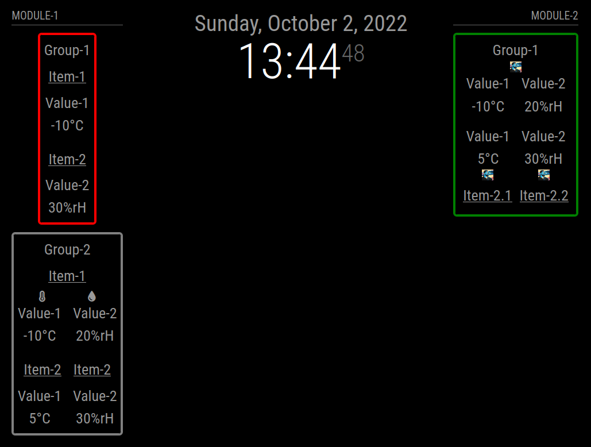
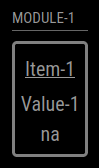

# MMM-ValuesByNotification

Need a MagicMirror² module which is able to display information which is send by a other module like [MMM-MQTTbridge](https://github.com/sergge1/MMM-MQTTbridge) or [MMM-CommandToNotification](https://github.com/Tom-Hirschberger/MMM-CommandToNotification)?
The information is provided as a simple message or as an JSON-Object?
You want to re-format the message before displaying it or want to select single values within the JSON-Object?
You need more than one instance and do want to style the instances different?
Do you want to style the elements or change displayed icons based on thresholds?
Do you want some elements to only be visible if a certain profile is active?

Then this is the module you need!

BUT i think i created a monster. The configuration can be very tricky!
Look a the [screenshots](doc/screenshots) and at the provided configuration [examples](doc/configs).

<p align="center">
 
</p>

[Example-Config](doc/configs/twoModulesOneWithAlert.config.js)

[Example-CSS](doc/configs/twoModulesOneWithAlert.custom.css)

In this screenshot you see two instances of the module which are called MODULE-1 and MODULE-2.
MODULE-1:

* Contains two groups (Group-1 and Group-2)
* Group-1 shows two items (Item-1 and Item-2) which do have added titles
  * Item-1 shows a temperature value with unit °C
  * Item-2 shows a humidity value with unit %rH
* The border of Group-1 is in red color because one of the values reached a threshold (temperature < 10)
* Group-2 shows two Items (Item-1 and Item-2)
  * Item-1 has one title added contains two values which do have an additional icon and title
  * Item-2 has two titles (Item-2 twice) and two values which do have an additional title but no icons

MODULE-2

* Contains one group (Group-1)
* Group-1 has an additional image icon
* The default color of the border of Group-1 has been changed to green
* If a threshold is reached the color of Group-1 changes to red (like Group-1 in MODULE-1)
* Item-1 has no title and shows two values (Value-1 and Value-2)
  * Value-1 shows the temperature with unit °C
  * Value-2 shows the humidity with unit %rH
* Item-2 has two values
* The order of the elements of Item-2 has changed to display the two tiles of Item-2 after the elements containing the values
* The values of Item-2 show an title (Value-1, Value-2), the values with units and an image icon

## Basic features

* Display the content of notifications (either simple values or elements of JSON objects)
* Use JSONPath syntax to select the values in messages sending a JSON object
* Re-format the values with JavaScript functions
* Add titles and/or icons (either fontawesome icons or images)
* Display the title/values/units in different order based on the group or item
* Display a placeholder (not available) value if either the provided information is to old (reused to often) or had not been provided till now
* Group the values into items and groups and add icons either to the values, items or groups
* Change the icons and/or add classes based on thresholds
* Display multiple instances of this module with different styling in different positions
* Display some elements only if a certain profile is active ([MMM-ProfileSwitcher](https://github.com/tosti007/MMM-ProfileSwitcher))

## Basic installation

```bash
cd ~/MagicMirror/modules
git clone https://github.com/Tom-Hirschberger/MMM-ValuesByNotification.git
cd MMM-ValuesByNotification
npm install
```

## Basic configuration

Add the following code to your ~/MagicMirror/config/config.js:

```json5
  {
   module: "MMM-ValuesByNotification",
   position: "top_left",
   header: "Module-1",
   config: {
    groups: [
     {
      items: [
       {
        notification: "TEST1",
        itemTitle: "Item-1",
        values: [
         {
            valueTitle: "Value-1",
         },
        ]
       },
      ]
     },
    ]
   },
  },
```

[Basic configuration](doc/configs/basicConfiguration.config.js)

Restart your mirror and you should see something like this:



This very basic example has the following features:

* Display one group which does not have any icon or title
* Display one item in this group which does not have an icon but title Item-1 set
* Display one value Value-1 with no unit or icon but with a title and value within Item-1

## General options

| Option  | Description | Type | Default |
| ------- | --- | --- | --- |
| groups | This is the array containing the configuration of the groups, which contain the items, which contain the values... | Array | [] |
| updateInterval | How often should the module be refreshed (in seconds) | Integer | 60 |
| naValue | Which value should be displayed if a specific notifcation has not be received till now or if the information was to long in the past? You will learn to override this value in the group, item or value section later. | String | "na" |
| reuseCount | How many intervals should values of notifications be used before they get marked as stale and the "not available" value is used instead? You will learn to override this counter in the [Groups](doc/groups.md) and [Items](doc/items.md) section later. | Integer | 1 |
| animationSpeed | How many milliseconds should be used to animate the refresh | Integer | 500 |
| notificationPrefix | Do the notifications you want to use for the values start all with the same prefix. You can specify a prefix here and use only the suffix in the item configurations later. | String | null |
| classes | Should css classes be added to each html element? Configure them as a space separated string here. This is useful if you have two instances of the module and like to style them different. You will learn how to add more classes to specific groups, items, values in later sections ([Classes](doc/classes.md)). | String | null |
| addClassesRecursive | Should classes that are configured at a higher level (here, groups, items) automatically be added to all sub elements as well or only at that level they are configured in? | Boolean | false |
| letClassesBubbleUp | Should classes that are configured at a lower level be set to elements in higher levels as well? This is useful if you configure [Thresholds](doc/thresholds.md) and want to change the style of wrapper elements. | Boolean | true |
| basicElementType | The modules uses a lot of wrapper elments. What kind of html element should be used for this ("span" or "div" in most cases) | String | "span" |

## More configuration

Look at [Documentation](doc/README.md) to get more configuration options!

[Values](doc/values.md)

[Items](doc/items.md)

[Groups](doc/groups.md)

[Icons](doc/icons.md)

[Titles](doc/titles.md)

[Classes](doc/classes.md)

[Thresholds](doc/thresholds.md)

[Profiles](doc/profiles.md)
