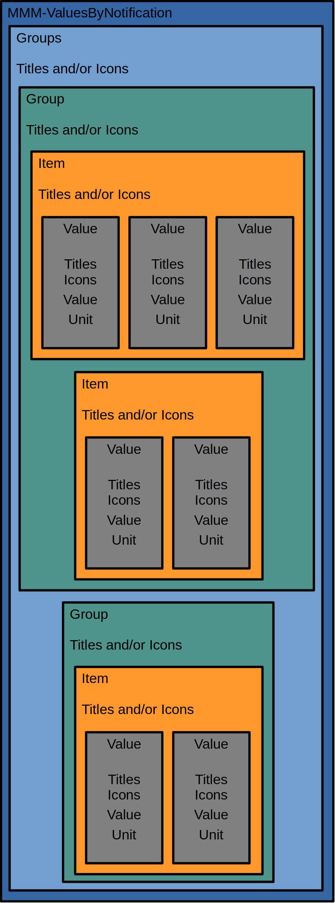
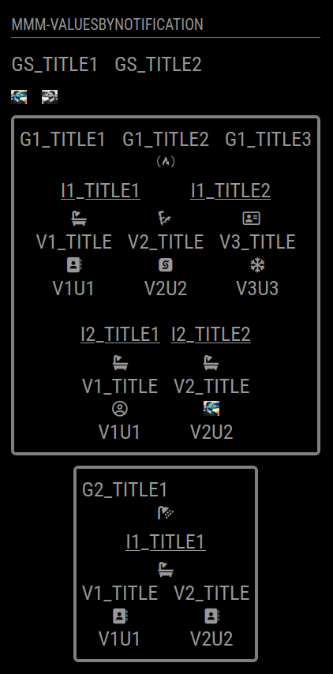

# MMM-ValuesByNotification configuration

This documentation describes all options which are supported of the module. But first some basics...

## Basic structure of the module

Basically the module displays [Values](values.md) and their units based on information provided by the payload of notifications. In addition to the pure value and its unit it is possible to display one or more [Titles](titles.md) for a single value and one or more [Icons](icons.md).

The [Values](values.md) are arranged in [Items](items.md). **All [Values](values.md) of a [Item](items.md) get their information by the same notification.** [Icons](icons.md) or [Titles](titles.md) may be added to the [Items](items.md) as well.

The [Items](items.md) are arranged in [Groups](groups.md) which support [Icons](icons.md) and [Titles](titles.md) as well.

All groups are arranged in one elment which supports [Titles](titles.md) and [Icons](icons.md) like the others.

The following schema tries to illustrate this structure:

 

And this it will look like in the module:

 

[Example-Configuration](configs/moduleLikeelementSchema.config.js)

In the sections below you will see that the titles do not need to be the first element, that it will be possible to add custom css classes to elements if needed or if thresholds are reached and much more.

[Groups](groups.md)

[Items](items.md)

[Values](values.md)

[Titles](titles.md)

[Icons](icons.md)

[Thresholds](thresholds.md)

[Profiles](profiles.md)

