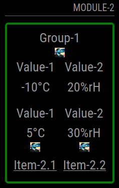

# Positions

Positions can be configured for the elements of groupsWrapper, groupWrapper, itemWrapper and valueWrapper. The options vary between the valueWrapper and the others.

The basic idea is that a string defines in which order the elements of a wrapper should be added.

In the case of groups, group and item the key-characters "t" for title, "i" for icon, "d" for dummy and "e" for elements are possible.

In the case of the valueWrapper the key-characters "t" for title, "i" for icon, "d" for dummy, "v" for value and "u" for are possible.

If you want some elements to stay together (but they are still in their own sub-elements) you can be fine a wrapper with "[]" brackets.

The wrapper gets css classes added which will be the value of the "automaticWrapperClassPrefix" and the value suffixed with a counter. The counter starts with 0 and will be increased for every wrapper within this positions definition.

In the following example we can see some positions configuration:

<p align="center">
 
</p>

While the first item displays the icons first and then the elements the second item displays the elements first followed by the icons and finally the titles of the item.

The configuration of Item-1 is:

```json5
itemPositions: "ie",
```

The configuration of Item-2 is:

```json5
itemPositions: "eit",
```
